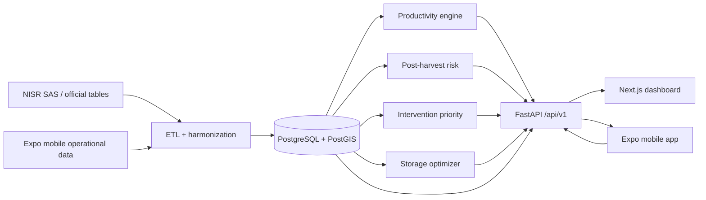

# Cropmatics Rwanda

**Crop Intelligence from Data to Action.**

A full-stack agricultural decision-intelligence platform for the **NISR 2026 Big
Data Hackathon — Track 1: Agricultural Productivity**. Cropmatics Rwanda combines
agricultural informatics, statistical analysis, machine learning, geospatial
intelligence and optimization to turn official agricultural statistics,
geospatial information and operational field data into actionable insights for
farmers, cooperatives and agricultural decision-makers.

> Results describe **associations** and **priorities for investigation** — not
> proven causal effects. See [MODEL_INTERPRETATION_POLICY](docs/MODEL_INTERPRETATION_POLICY.md).

## Why it exists

Rwanda has rich agricultural statistics, but raw data do not automatically tell
planners where productivity gaps are greatest, which observed factors track with
them, where to investigate first, or how upcoming harvests should be coordinated
with storage. Cropmatics turns that data into reviewable action.

## Architecture



Official statistics, external open data and voluntary app data are kept in
separate layers and never merged at respondent level.

## Stack

| Layer | Stack |
|---|---|
| Web | Next.js (App Router) + React + TypeScript + Tailwind + TanStack Query |
| Mobile | React Native + Expo + Expo Router + SQLite (offline-first) + TanStack Query |
| Backend | Python 3.11 + FastAPI + Pydantic + SQLAlchemy 2 + Alembic |
| Database | PostgreSQL + PostGIS |
| ML | pandas, scikit-learn; SHAP; OR-Tools |
| Deployment | Vercel + Render/Fly + Neon/Supabase + Expo EAS |

## Repository layout

```text
apps/web              Next.js planner dashboard
apps/mobile           Expo farmer/field-officer app (offline-first)
services/api          FastAPI service (routers, models, services, analytics, optimization)
ml                    productivity gap, yield model, risk, priority, storage optimization
data                  raw | external | interim | processed | dictionaries | source_registry | dev_fixtures
scripts               data pipeline + db/dev/deployment helpers
docs                  audit, architecture, policy, and reference documents
infra                 infrastructure notes
```

## Datasets

Real NISR/MINAGRI-derived data for 2024–2026 lives under
`data/raw/cropmatics_real_data_2024_2026/`, including the original NISR Season B
workbook (`raw_official/`). District × crop productivity and district
input/practice tables are the analytical core; national trends provide context.
Synthetic demo records are isolated in `data/dev_fixtures/` and clearly labelled.

See [05_DATASET_CATALOG](docs/05_DATASET_CATALOG.md) and
[DATA_PROVENANCE](docs/DATA_PROVENANCE.md).

## Status

| Area | State |
|---|---|
| Data layer + pipeline | ✅ Working (validate → normalize → build) |
| Reference dictionaries | ✅ 30 districts, 17 crop categories |
| Backend skeleton + analytics/optimization endpoints | ✅ Working (DB-backed auth/harvest pending DB) |
| ML modules + tests | ✅ Working (gap, priority, risk, metrics, optimizer) |
| Web app | ✅ Starts; overview/dashboard/productivity/planner/storage/transparency |
| Mobile app | ✅ Starts; offline harvest registration + sync queue |
| Database migrations | ⚠️ Alembic configured; first revision not yet generated |
| Auth/RBAC, notifications, reports export | ⚠️ Partial / scaffolded |
| Deployment | ⚠️ Documented, not provisioned |

Full details: [REPOSITORY_REFINEMENT_REPORT](docs/REPOSITORY_REFINEMENT_REPORT.md).

## Getting started

Prerequisites: Node 20+, pnpm 9+, Python 3.11+, and (optionally) Docker for Postgres/PostGIS.

```bash
# 1. Environment
cp .env.example .env         # then edit secrets

# 2. JavaScript workspaces (web + mobile)
pnpm install

# 3. API virtualenv
make install-api             # creates services/api/.venv and installs deps

# 4. Build analytical tables from raw official data
make data                    # -> data/processed/training_district_crop.csv
```

### Run

```bash
make api                     # FastAPI on http://localhost:8000
make web                     # Next.js on http://localhost:3000
make mobile                  # Expo dev server
```

### Database

```bash
make db-up                   # PostGIS via docker compose
make migrate                 # apply Alembic migrations
make db-init                 # or create tables directly from models (dev)
```

### Data pipeline

```bash
make data           # validate + normalize + build processed tables
make data-validate  # validation report only
python scripts/data/load_database.py   # load processed tables into Postgres
```

### ML

```bash
make ml             # baseline yield model -> ml/reports/ model card
```

### Quality

```bash
make lint           # web + mobile + Python (ruff)
make typecheck      # web + mobile
make test           # API + ML pytest
```

## Documentation

Start at [DOCUMENTATION_INDEX.md](DOCUMENTATION_INDEX.md). Key documents:
audit ([00](docs/00_REPOSITORY_AUDIT.md)), architecture
([03](docs/03_SYSTEM_ARCHITECTURE.md), [04](docs/04_DATA_ARCHITECTURE.md)), rename
record ([PROJECT_RENAME_REPORT](docs/PROJECT_RENAME_REPORT.md)),
API ([07](docs/07_API_ARCHITECTURE.md)), ML
([10](docs/10_ML_METHODOLOGY.md)), and the interpretation policy
([MODEL_INTERPRETATION_POLICY](docs/MODEL_INTERPRETATION_POLICY.md)).

## Data policy

- Official NISR/MINAGRI statistics and voluntary app data are kept separate.
- Respondent-level NISR microdata is **not** redistributed.
- Missing values are `null`; capacity is never invented.
- Synthetic fixtures are test-only and labelled `SYNTHETIC`.

## License / provenance

See [DATA_LICENSE_AND_PROVENANCE.md](DATA_LICENSE_AND_PROVENANCE.md) and
[docs/DATA_PROVENANCE.md](docs/DATA_PROVENANCE.md).

