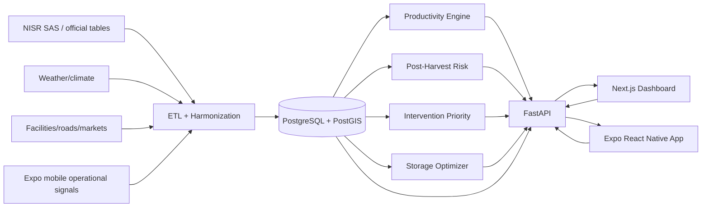

# 3. System Architecture

## Separate data layers
1. **Official statistical baseline**
2. **Operational app data**
3. **External open data**

Never label voluntary app data as nationally representative statistics.
